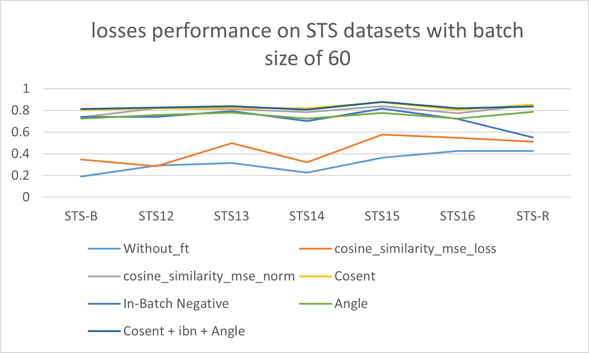

# Impact-of-loss-function-on-BERT-sentence-embedding
A sentence embedding evaluation framework that tests the impact of different loss functions (Cosine similarity mean square error, COSENT, IN-Batch Negative, Angle loss and combination of various losses) on the quality and performance of sentence embeddings on STS datasets (STS-B, STS 12 to STS 16 and STS-K).
The detail article is on overleaf project: https://www.overleaf.com/read/bzzbwqfxgrpn#1076e2


## Describtion on each python file

- Prepare_STS.py: prepare_STS.py file is the python file include build dataloader of STS datasets.
  
- Loss_Functions.py: Loss_Functions.py file is the python file include various of loss functions include default cosine similarity, COSENT, IBN and Angle losses and the combination of loss
  
- TrainSE.py: TrainSE.py file is the python file that has Training loop, evaluation function and base model.

## How to run the code
Follow the steps below to set up and run the project:

- clone the repo from github then directory to the repo
```bash
# Step 1: Clone the repository
git clone https://github.com/ShiqiZ1208/impact-of-loss-function-on-BERT-sentence-embedding.git
cd /impact-of-loss-function-on-BERT-sentence-embedding
```

- runing the Train.py code, -b refered to how many batch_size during fine-tune the model, -r refered to how many runs to average in order to get final result, -e refered to total eopchs takes during fine-tune the model, -l reference the learning rate for AdamW optimizer, -mode reference how much validation set have two modes eval and defualt.
```bash
# Step 2: run the code
python TrainSE.py -b BATCH_SIZE -r TOTAL_RUN -e TOTAL_EPOCHS_DURING_FINETUNE -l LEARNING_RATE -mode MODES
```
- We have a quick start colab notebooks [sample_run_on_sentenceEmbedding](https://github.com/ShiqiZ1208/impact-of-loss-function-on-BERT-sentence-embedding/blob/main/sample_run_on_sentenceEmbedding.ipynb)
## Performance Graph



## Datasets
-STS-B: The Semantic Textual Similarity Benchmark (STS-B) is part of the GLUE benchmark and was originally introduced in the Semantic Evaluation (SemEval) 2017 shared task. It was designed to evaluate how well systems can measure the semantic similarity between two sentences on a scale from 0 (no meaning overlap) to 5 (equivalent meaning).
The STS-B dataset includes sentence pairs drawn from various sources like news headlines, image captions, and forums, with human-annotated similarity scores.
```text
the detial infromation of STS-B datasets:
(Dataset({
    features: ['split', 'genre', 'dataset', 'year', 'sid', 'labels', 'sentence1', 'sentence2'],
    num_rows: 1379
})
```

-STS12: The STS 2012 dataset was introduced in the Semantic Textual Similarity (STS) Task at SemEval-2012. It was the first in a series of STS shared tasks aimed at evaluating models' ability to assign similarity scores to sentence pairs.
```text
the detial infromation of STS12 datasets:
(Dataset({
    features: ['split', 'sentence1', 'sentence2', 'labels'],
    num_rows: 3108
})
```

-STS13: The Semantic Textual Similarity 2013 (STS13) dataset was introduced in the SemEval-2013 Task 6, continuing the effort started in 2012 to benchmark systems that evaluate semantic similarity between sentence pairs. STS13 expanded the task by introducing new domains and further testing the generalizability of similarity models across different text types.
```text
the detial infromation of STS13 datasets:
(Dataset({
    features: ['split', 'sentence1', 'sentence2', 'labels'],
    num_rows: 1500
})
```

-STS14: The Semantic Textual Similarity 2014 (STS14) dataset was introduced in the SemEval-2014 Task 10, continuing the STS series designed. aimed to test robustness across domains, incorporating sentence pairs from diverse sources.
```text
the detial infromation of STS14 datasets:
(Dataset({
    features: ['split', 'sentence1', 'sentence2', 'labels'],
    num_rows: 3750
})
```

-STS15: The Semantic Textual Similarity 2015 (STS15) dataset was introduced in SemEval-2015 Task 2
```text
the detial infromation of STS15 datasets:
(Dataset({
    features: ['split', 'sentence1', 'sentence2', 'labels'],
    num_rows: 3000
})
```

-STS16: The Semantic Textual Similarity 2016 (STS16) dataset was introduced as part of SemEval-2016 Task 1. Like its predecessors, STS16 evaluates systems’ ability to score the semantic similarity between pairs of sentences using a scale from 0 (no similarity) to 5 (semantic equivalence).

```text
the detial infromation of STS16 datasets:
(Dataset({
    features: ['split', 'sentence1', 'sentence2', 'labels'],
    num_rows: 1186
})
```

-SICK-R: The Sentences Involving Compositional Knowledge - Relatedness (SICK-R) dataset was introduced in 2014 to support research on compositional semantic similarity and textual entailment.
SICK-R consists of about 10,000 English sentence pairs, created by semi-automatically combining image captions and video descriptions. Each pair is annotated with a relatedness score ranging from 1 (completely unrelated) to 5 (highly related), capturing semantic similarity.
```text
the detial infromation of SICK-R datasets:
(Dataset({
    features: ['sentence1', 'sentence2', 'labels'],
    num_rows: 9927
})
```

## Base model BERT-uncase-base
-The BERT-base uncased model is a transformer-based language model designed to understand and generate natural language. It is pretrained on large amounts of English text where all words are converted to lowercase, which means it ignores casing differences. The model consists of 12 transformer encoder layers, each containing 12 self-attention heads. These layers work together to produce contextualized embeddings of input tokens. The hidden size of the model is 768, meaning each token is represented by a 768-dimensional vector.
One important feature is the special [CLS] token at the start of every input, whose final hidden state is commonly used as a fixed-size summary representation of the entire sequence. This is especially useful for sentence embedding tasks. Overall, BERT-base uncased contains about 110 million parameters, striking a balance between performance and efficiency, making it a popular choice for many natural language processing applications.
```text
BertModel(
  (embeddings): BertEmbeddings(
    (word_embeddings): Embedding(30522, 768, padding_idx=0)
    (position_embeddings): Embedding(512, 768)
    (token_type_embeddings): Embedding(2, 768)
    (LayerNorm): LayerNorm((768,), eps=1e-12, elementwise_affine=True)
    (dropout): Dropout(p=0.1, inplace=False)
  )
  (encoder): BertEncoder(
    (layer): ModuleList(
      (0-11): 12 x BertLayer(
        (attention): BertAttention(
          (self): BertSdpaSelfAttention(
            (query): Linear(in_features=768, out_features=768, bias=True)
            (key): Linear(in_features=768, out_features=768, bias=True)
            (value): Linear(in_features=768, out_features=768, bias=True)
            (dropout): Dropout(p=0.1, inplace=False)
          )
          (output): BertSelfOutput(
            (dense): Linear(in_features=768, out_features=768, bias=True)
            (LayerNorm): LayerNorm((768,), eps=1e-12, elementwise_affine=True)
            (dropout): Dropout(p=0.1, inplace=False)
          )
        )
        (intermediate): BertIntermediate(
          (dense): Linear(in_features=768, out_features=3072, bias=True)
          (intermediate_act_fn): GELUActivation()
        )
        (output): BertOutput(
          (dense): Linear(in_features=3072, out_features=768, bias=True)
          (LayerNorm): LayerNorm((768,), eps=1e-12, elementwise_affine=True)
          (dropout): Dropout(p=0.1, inplace=False)
        )
      )
    )
  )
  (pooler): BertPooler(
    (dense): Linear(in_features=768, out_features=768, bias=True)
    (activation): Tanh()
  )
)
```
## datasets distribution
-We have conduct a test on dataset distribution and cosine similarity score on embedding on each datasets.
```bash
python Label_similarity.py -d 'STS-B' (dataset name)
```
